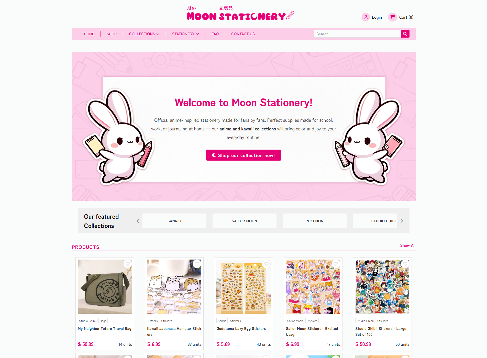
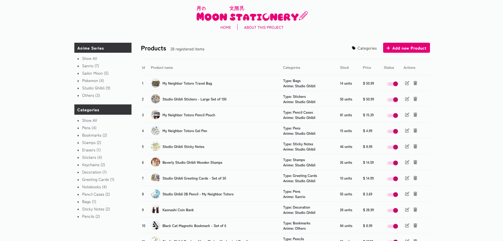

# 🌙 Moon Stationery | 月の文房具 (Tsuki no Bunbougu)

**Moon Stationery** is a fictional online store for lovers of anime culture and beautiful everyday-use stationery.  
We offer a platform that showcases officially licensed anime merchandise and cute stationery items in a seamless shopping experience. And a admin panel to manage said inventory intuitively. 

## Storefront

## Dashboard

---

## 🖥 Tech Stack

- **Backend:** Java, Spring Boot, JDBC
- **Frontend:** Thymeleaf, HTML, CSS, JavaScript
- **Database:** PostgreSQL
- **Architecture:** MVC (Model-View-Controller)

---

## ✨ Features
### 🏠 User-Facing (Storefront)
- **Display all products** with detailed info on all **pages**
- Navigation menu includes:
  - **Home**
  - **Login** (modal)
  - **FAQ**
- **Category menu**
- **Featured anime collections** products
- **Dynamic search filter**
- **Breadcrumbs**
- Global **search bar**
- **Category** pages:
  - Show all related products by category
- **Product details** page:
  - Shows full product info in detail
  - Related products from the same category
  
---

## 🛠 Admin Dashboard
### 📦 Product Management
- Product table with:
  - Create new categories
  - Delete unused categories
  - Create new products using existing categories
  - Edit or delete existing products
  - Toggle product visibility on the homepage

---

> This is a fake e-commerce platform built for educational purposes only.  
> All branding, products, and licenses are fictional or used as inspiration for UI/UX practice.
